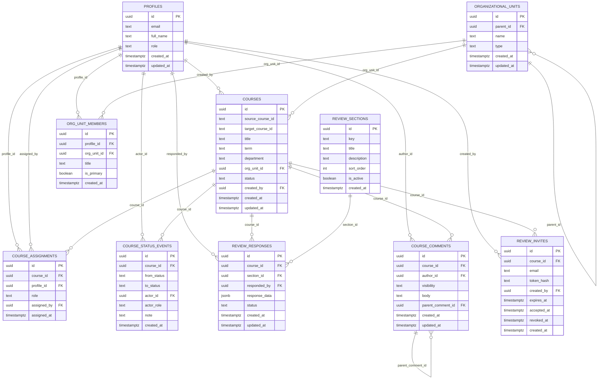

# Final Schema Graph

```mermaid
erDiagram
  PROFILES {
    uuid id PK
    text email
    text full_name
    text role
    timestamptz created_at
    timestamptz updated_at
  }

  COURSES {
    uuid id PK
    text source_course_id
    text target_course_id
    text title
    text term
    text department
    uuid org_unit_id FK
    text status
    uuid created_by FK
    timestamptz created_at
    timestamptz updated_at
  }

  COURSE_ASSIGNMENTS {
    uuid id PK
    uuid course_id FK
    uuid profile_id FK
    text role
    uuid assigned_by FK
    timestamptz assigned_at
  }

  COURSE_STATUS_EVENTS {
    uuid id PK
    uuid course_id FK
    text from_status
    text to_status
    uuid actor_id FK
    text actor_role
    text note
    timestamptz created_at
  }

  REVIEW_SECTIONS {
    uuid id PK
    text key
    text title
    text description
    int sort_order
    boolean is_active
    timestamptz created_at
  }

  REVIEW_RESPONSES {
    uuid id PK
    uuid course_id FK
    uuid section_id FK
    uuid responded_by FK
    jsonb response_data
    text status
    timestamptz created_at
    timestamptz updated_at
  }

  COURSE_COMMENTS {
    uuid id PK
    uuid course_id FK
    uuid author_id FK
    text visibility
    text body
    uuid parent_comment_id FK
    timestamptz created_at
    timestamptz updated_at
  }

  REVIEW_INVITES {
    uuid id PK
    uuid course_id FK
    text email
    text token_hash
    uuid created_by FK
    timestamptz expires_at
    timestamptz accepted_at
    timestamptz revoked_at
    timestamptz created_at
  }

  ORGANIZATIONAL_UNITS {
    uuid id PK
    uuid parent_id FK
    text name
    text type
    timestamptz created_at
    timestamptz updated_at
  }

  ORG_UNIT_MEMBERS {
    uuid id PK
    uuid profile_id FK
    uuid org_unit_id FK
    text title
    boolean is_primary
    timestamptz created_at
  }

  PROFILES ||--o{ COURSES : "created_by"
  PROFILES ||--o{ COURSE_ASSIGNMENTS : "profile_id"
  PROFILES ||--o{ COURSE_ASSIGNMENTS : "assigned_by"
  PROFILES ||--o{ COURSE_STATUS_EVENTS : "actor_id"
  PROFILES ||--o{ REVIEW_RESPONSES : "responded_by"
  PROFILES ||--o{ COURSE_COMMENTS : "author_id"
  PROFILES ||--o{ REVIEW_INVITES : "created_by"
  PROFILES ||--o{ ORG_UNIT_MEMBERS : "profile_id"

  COURSES ||--o{ COURSE_ASSIGNMENTS : "course_id"
  COURSES ||--o{ COURSE_STATUS_EVENTS : "course_id"
  COURSES ||--o{ REVIEW_RESPONSES : "course_id"
  COURSES ||--o{ COURSE_COMMENTS : "course_id"
  COURSES ||--o{ REVIEW_INVITES : "course_id"

  REVIEW_SECTIONS ||--o{ REVIEW_RESPONSES : "section_id"

  ORGANIZATIONAL_UNITS ||--o{ ORGANIZATIONAL_UNITS : "parent_id"
  ORGANIZATIONAL_UNITS ||--o{ ORG_UNIT_MEMBERS : "org_unit_id"
  ORGANIZATIONAL_UNITS ||--o{ COURSES : "org_unit_id"

  COURSE_COMMENTS ||--o{ COURSE_COMMENTS : "parent_comment_id"
```

