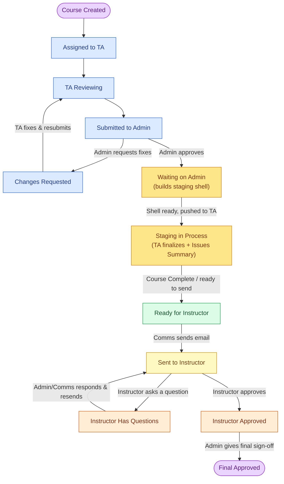
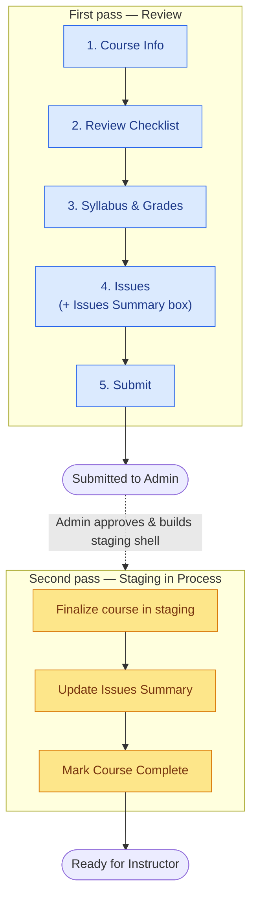
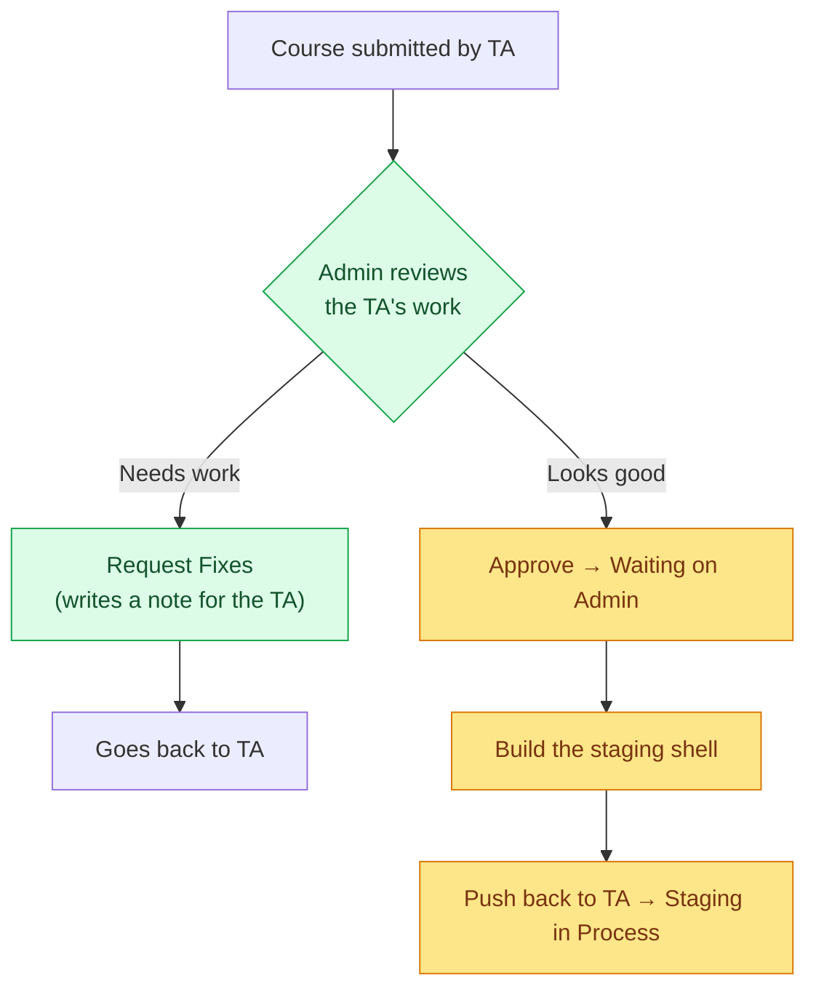
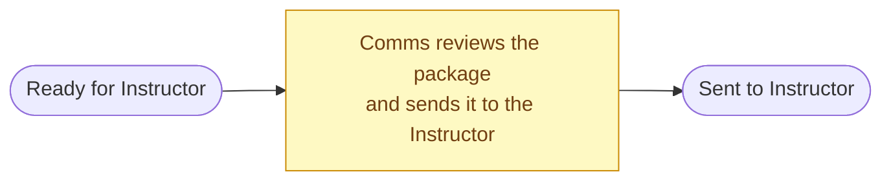
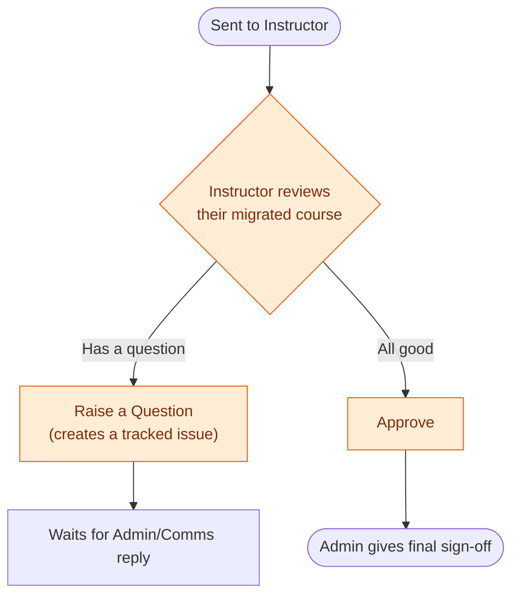
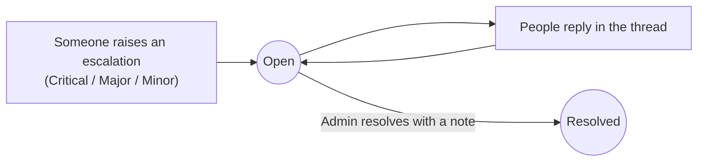

# CourseBridge — How It Works (Plain-Language Walkthrough)

> A guide for everyone — no technical background needed.
> Open this file in a Markdown preview with Mermaid enabled to see the diagrams.
> Each diagram also lives as its own file in `docs/diagrams/` (open any `.mmd` file with your Mermaid extension).

---

## 1. What is CourseBridge?

When a course moves from the old system (Moodle) to the new system (Brightspace),
someone has to **check that nothing broke** — the syllabus, the grades setup, the
files, the links. CourseBridge is the tool that **manages those reviews from start to finish**.

Think of each course as a **case file** that travels through a series of desks.
At each desk a specific person does their part, then passes it along. Nobody can
skip a desk, and the system always knows exactly where every course is.

---

## 2. The five people involved

| Role | In plain words | What they mainly do |
|------|----------------|---------------------|
| **TA** (Staff) | The reviewer | Opens an assigned course, checks everything, fills the review forms, submits it — and later finalizes the course in staging |
| **Admin** | The gatekeeper | Assigns courses to TAs, checks the TA's work, builds the staging shell, approves or sends it back |
| **Communications** | The messenger | Sends the approved course package to the instructor |
| **Instructor** | The course owner | Looks over their migrated course, asks questions or approves |
| **Super Admin** | The manager | Manages users, sees everything, full audit history |

---

## 3. The big picture (the whole journey)

**Read it as a story:**
1. A course is created and **assigned to a TA**.
2. The **TA reviews** it and **submits** to the Admin.
3. The **Admin** either **approves** it or **sends it back for fixes**.
4. On approval the course **waits on the Admin** to build the **staging shell**.
5. When the shell is ready it's **pushed back to the TA** as **Staging in Process** — the TA finalizes the course and writes the **Issues Summary**.
6. The TA marks **Course Complete** → the course is **Ready for Instructor**.
7. **Communications sends the email** to the Instructor.
8. The **Instructor** asks questions or **approves**.
9. The Admin gives **final sign-off** — the course is done.

> 🆕 **What's new (steps 4–6):** the amber boxes — *Waiting on Admin* and *Staging in Process* — are a newly added phase between "Submitted to Admin" and "Ready for Instructor". See the dedicated diagram in `docs/diagrams/07-staging-phase.mmd`.

---

## 4. Each role, step by step

### 4a. TA (the reviewer) — 🟦

The TA does the hands-on checking. Their work happens in a **5-step workspace**:

- Each step can be **saved as a draft** and finished later.
- A **progress bar** shows which steps are done (green checkmarks).
- If the Admin sends the course back, the TA sees the **Admin's note explaining what to fix**, makes changes, and resubmits.
- 🆕 After the Admin approves and builds the staging shell, the course comes **back to the TA** as **Staging in Process**. The TA finalizes the course, updates the **Issues Summary**, and marks **Course Complete** when it's ready to send.

### 4b. Admin (the gatekeeper) — 🟩

The Admin also:
- **Assigns** courses to TAs and instructors.
- 🆕 **Builds the staging shell** during *Waiting on Admin*, then pushes the course back to the TA.
- Can **edit the Issues Summary** alongside the TA.
- Sees an **Overview dashboard** (totals, workloads, what's pending).
- Handles **escalations** (see section 5).
- Gives the **final sign-off** after the instructor approves.

### 4c. Communications (the messenger) — 🟨

Communications is a focused role: they take an **approved** course and **hand it to the instructor**. If the instructor has questions, Comms (or Admin) responds and **resends**.

### 4d. Instructor (the course owner) — 🟧

The instructor sees a **read-only view** of the TA's review, a **Questions** area, and a **Discussion** thread shared with the TA and Admin.

### 4e. Super Admin (the manager) — 🟪

The Super Admin can do everything any other role can, plus:
- **Manage users** and the **organization** structure.
- See the **full audit log** — every status change, who did it, and when.
- View **system-wide analytics**.

---

## 5. Things that happen alongside the main flow

### Escalations — "something's wrong, flag it"

Anyone can raise an **escalation** (a flagged problem) with a severity:
**Critical / Major / Minor**. It opens a **thread** where people discuss it, and an
Admin marks it **Resolved** with a note.

> Important: an escalation is a **side conversation**. Resolving it does **not** by
> itself move the course forward — a person still drives the course through the steps.

### Discussions — two separate chat channels

- **Internal chat:** TA ⇄ Admin only (private working channel).
- **Shared discussion:** TA, Admin, Communications, and Instructor all see it.

### Notifications

- A **bell** in the top bar shows a count of things needing attention.
- A **Notifications page** lists everything (assignments, actions, issues, comments).

### 🆕 Issues Summary

- A single **free-text summary** of the course's issues, living on the **Issues tab**.
- Editable by **both the TA and the Admin**.
- Finalized during **Staging in Process**, just before the email goes to the instructor — so it travels with the course as a plain-language recap of what was found and fixed.

---

## 6. What's NOT built yet (so expectations are accurate)

These are in the plan but **not implemented today**:

| Feature | Status |
|---------|--------|
| Uploading files / screenshots as evidence | Planned, not built |
| Exporting a course review as a PDF | Planned, not built |
| Browser push notifications (alerts outside the app) | Planned — in-app only for now |

---

## 7. Decided changes (being added now)

- 🆕 **New staging phase:** *Waiting on Admin* (admin builds the staging shell) and *Staging in Process* (TA finalizes) now sit between "Submitted to Admin" and "Ready for Instructor".
- 🆕 **Course Complete** in *Staging in Process* moves the course straight to *Ready for Instructor*, where Comms/Admin sends the email.
- 🆕 **Issues Summary box** on the Issues tab, editable by TA and Admin.

## 8. Open questions / things we may still change

These are the "rough edges" still worth discussing:

1. **Instructor → TA loop:** Today, if the instructor's question needs the *TA* to
   fix something, there's no clean path back to the TA — only back to Comms/Admin.
2. **Final Approved is the end:** there's no built-in "reopen" if a mistake is found later.
3. **A bulk "approve to staging" action** can move many courses forward at once,
   skipping the normal step-by-step checks.
4. **Submitting** is blocked in the screen until sections look complete, but that
   completeness isn't enforced deeper down.
5. **Escalations don't move the course** — but the app already nudges "you can
   resubmit now" once they're resolved, which suggests people *want* a link between them.

---

*Diagrams in this document are also available as individual files in `docs/diagrams/` for editing or exporting as images.*
