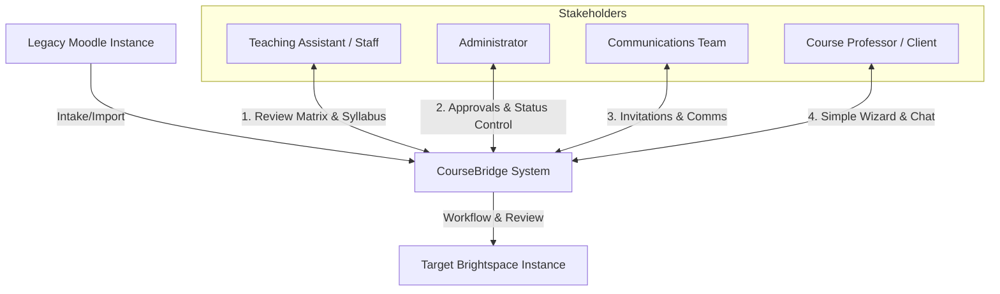
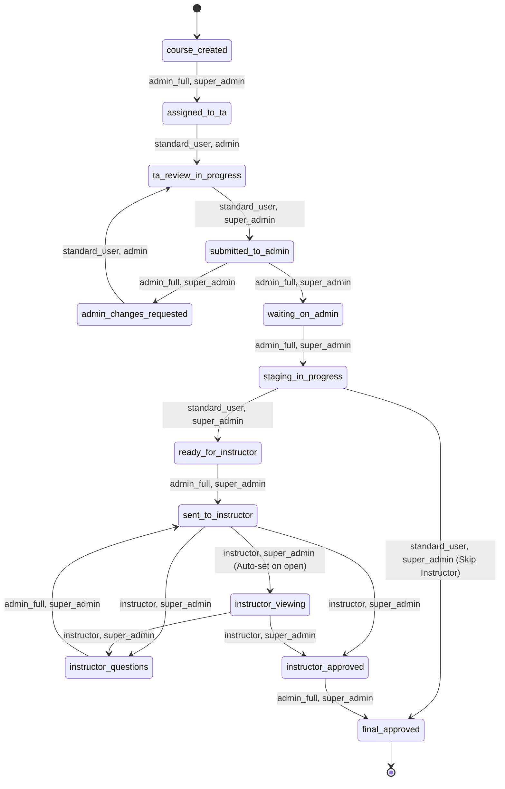
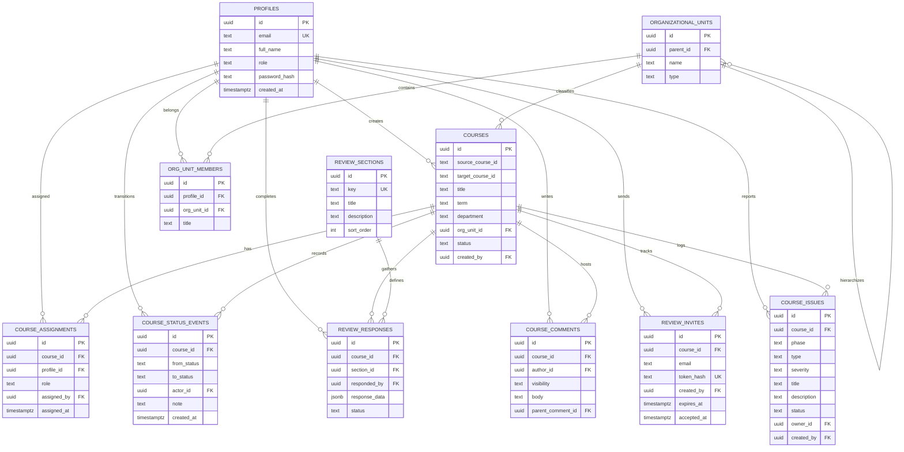

# CourseBridge Developer Guide: System Architecture

Welcome to the CourseBridge Technical Architecture Guide. This document provides a deep dive into the design principles, file structure, workflow state machine, database schema, and integrations that form the CourseBridge application.

---

## 1. System Overview & Purpose

CourseBridge is a dedicated university course migration case management and review platform. Its primary purpose is to orchestrate and audit the process of migrating courses from **Moodle** (the legacy LMS) to **Brightspace** (the target LMS). 

Rather than just being a checklist or form builder, CourseBridge is designed as a structured case-flow management tool. It ensures that migration workflows are predictable, auditable, and collaborative across multiple university stakeholder roles.



---

## 2. Monorepo Structure

CourseBridge is structured as a monorepo managed by **Turborepo**. The codebase is split into applications (`apps/`) and shared packages (`packages/`) to decouple domain logic, styling, and data storage.

```text
/
├── apps/
│   └── web/                # Next.js App Router Web Application
├── packages/
│   ├── workflow/           # State machine rules, roles, and status enums
│   ├── auth/               # Auth helpers and boundary utilities
│   ├── validation/         # Shared schemas (e.g. Zod validators)
│   ├── storage/            # Object storage interfaces (e.g. Cloudflare R2)
│   ├── ui/                 # Core design system and shared component stubs
│   └── config/             # Tooling configs (TypeScript, ESLint, PostCSS)
├── docs/                   # Developer documentation & plans
├── supabase/
│   └── snippets/           # Database snippets
├── db/
│   └── migrations/         # Database migrations (PostgreSQL DDL/DML)
└── scripts/                # Database seed and maintenance scripts
```

### apps/web
This is a Next.js 16 App Router application. It serves as the frontend client and the primary server backend via Server Actions and Route Handlers.
*   **Routing**: Clean directory layout separating public routes (`/auth`) and private dashboard surfaces under the `(dashboard)` route group.
*   **Data Access**: All data queries and mutations leverage a clean repository pattern (`getCourseRepository()`, `getCommentRepository()`) to decouple database implementation from UI components.
*   **Interactive Components**: Standard UI primitives utilize Radix UI and shadcn/ui styles. Hover states, progress indicators, and custom badges are standard across dashboards.

### packages/workflow
The system's rulebook. It is written in pure TypeScript and contains **no database dependencies**.
*   [`statuses.ts`](file:///mnt/data/projects/BrightBridge/packages/workflow/src/statuses.ts): Defines the list of valid course statuses, user-friendly labels, and grouping structures like pipeline phases and "Ball in Court" assignments.
*   [`transitions.ts`](file:///mnt/data/projects/BrightBridge/packages/workflow/src/transitions.ts): Declares allowed transitions (from/to) and role guards.
*   [`roles.ts`](file:///mnt/data/projects/BrightBridge/packages/workflow/src/roles.ts): Enumerates app roles.

---

## 3. Workflow State Machine

The heart of CourseBridge is its status state machine. A course record travels through a series of structured states, with transitions restricted by system and assignment roles.



### Pipeline Phases
Individual statuses are grouped into four high-level pipeline phases:
1.  **Migration** (`course_created`, `assigned_to_ta`, `ta_review_in_progress`)
2.  **Staging** (`submitted_to_admin`, `admin_changes_requested`, `waiting_on_admin`, `staging_in_progress`, `ready_for_instructor`)
3.  **Instructor** (`sent_to_instructor`, `instructor_viewing`, `instructor_questions`, `instructor_approved`)
4.  **Provision** (`final_approved`)

### Ball In Court (Responsibility Flow)
Each status maps to a specific "court" to clarify who is responsible for the next action:
*   **staff** (TA): `assigned_to_ta`, `ta_review_in_progress`, `admin_changes_requested`, `staging_in_progress`
*   **admin**: `course_created`, `submitted_to_admin`, `waiting_on_admin`, `ready_for_instructor`, `instructor_approved`
*   **instructor**: `sent_to_instructor`, `instructor_viewing`, `instructor_questions`
*   **done**: `final_approved`

---

## 4. The 3-Layer Access Control Model

CourseBridge implements a modular **3-Layer Access Model** to handle complex university structural hierarchies and user roles.

### Layer 1: Global System Roles (What you can DO)
Determines system-wide privileges, independent of department. Stored in `profiles.role`.
*   `super_admin`: Full system access, global configurations, and user creation/role management.
*   `provost`: Executive read-only oversight across all organizational levels with access to high-level analytics dashboards.
*   `admin_full`: Active operational manager. Can assign staff, trigger status transitions, and resolve issues.
*   `admin_viewer`: Global viewer. Read-only access to all dashboards and status queues, with the special permission to trigger instructor invite emails.
*   `standard_user`: Reviewing staff members ("TA"). Action permissions are restricted to Layer 2 and Layer 3 scopes.
*   `instructor`: Target instructors. Restrictive access to assigned course workspaces.

### Layer 2: Organizational Hierarchy (What you can SEE)
Implicit read/view access based on the university's structure. Stored in `organizational_units` and `org_unit_members`.
*   Uses an **Adjacency List** SQL structure: `organizational_units` has `parent_id` referencing itself (e.g., *Faculty of Applied Sciences* -> *School of Computing*).
*   Courses are tied to specific org units via `courses.org_unit_id`.
*   Users are linked to units via `org_unit_members` with titles like "dean" or "dept_head".
*   **Rule**: A user inherits implicit read-only access to a course if it belongs to an organizational unit that is a child or descendant of the unit they manage.

### Layer 3: Case Team Assignments (What you actively WORK ON)
Explicit write permissions on a course-by-course basis. Stored in `course_assignments`.
*   `staff` (TA): Assigned to execute the 5-step review workspace and finalize staging.
*   `instructor`: Assigned to inspect the finalized shell, ask questions in the course chat, and submit approvals.
*   **Rule**: Even if a user has Layer 2 hierarchy visibility (e.g., a Dean or Department Head), they cannot edit a review checklist, write comments, or sign off on a course unless they are explicitly assigned in Layer 3.

---

## 5. Database Schema & Data Model

The primary database is PostgreSQL hosted on **Supabase**. The application does not rely on direct database exposure or Supabase Auth's client-side policies; instead, it uses **Application-Layer PBAC** inside Next.js API routes and Server Actions.



### Key Tables Detail
1.  `profiles`: Contains user profiles. Roles are mapped using standard strings aligned with `packages/workflow`.
2.  `courses`: The core entity table. Stores identifiers, metadata, current status, and organization unit associations.
3.  `course_assignments`: Pivot table connecting courses, users, and assigned workflow roles.
4.  `course_status_events`: Auto-written log tracking who moved a course from which state, when, and any accompanying transition comments.
5.  `review_sections` & `review_responses`: Define checklists (e.g. metadata compliance, gradebook schema verification) and store JSON-structured responses submitted by TAs.
6.  `course_issues`: Unified issue tracker. Consolidates questions, escalations, major bugs, or general feedback. Integrates comments and @mentions.
7.  `review_invites`: Generates secure, hash-verified magic login links for external instructors, enabling OIDC-free, single-course restricted sessions.

---

## 6. Core Integrations

CourseBridge binds serverless frontend hosting, real-time sync, secure authentication, and AI analytics into a singular environment.

### Authentication & Session Flow
*   **Magic Link (OTP) Flow**: Transactional OTP links are delivered to authorized users. Accessing the OTP link verifies the secure token hash in the backend database and generates a signed session cookie.
*   **Password-Based Login**: Used primary for administrators and local development access. Passwords are securely hashed using `scrypt`.
*   **Dev Role Switcher**: A floating helper interface enabled in development/non-production mode, allowing quick role switching and account generation.
*   **Instructor Access**: External instructors receive email invites containing unique token strings. Accessing `/auth/invite/[token]` accepts the invite, links the session to their assigned course in `course_assignments`, and issues a restricted session cookie.

### Realtime Database Event Subscriptions
*   Supabase Realtime listens to SQL inserts/updates on `course_issues`, `course_issue_comments`, and `course_status_events`.
*   A client-side `NotificationProvider` consumes these subscriptions, debouncing and deduplicating channel connections to prevent client browser connection storms, and pushes real-time toast alerts and live counters to admin dashboard grids.

### Cloudflare R2 Object Storage
*   File attachments, course syllabus copies, and screenshots are stored directly in Cloudflare R2 via an S3-compatible SDK.
*   The database stores only metadata records (URLs, filenames, file sizes, mime types) to keep database backups light and transactional.

### Provost AI Analytics Assistant
*   A backend assistant powered by Anthropic's Claude API.
*   Allows executives to query high-level migration stats using natural language.
*   Translates natural language questions into safe, parameterized SQL read-only queries against database view snapshots (`slow_queries`, `course_status_counts`, `ta_workload`), preventing database injection.

### Sentry Error Instrumentation
*   Sentry is configured on both the client (Next.js React shell) and server (Next.js server-side functions and edge handlers).
*   Unhandled promise rejections, database query errors, and API timeouts automatically trigger alerts to the Dev team via Slack integrations.
